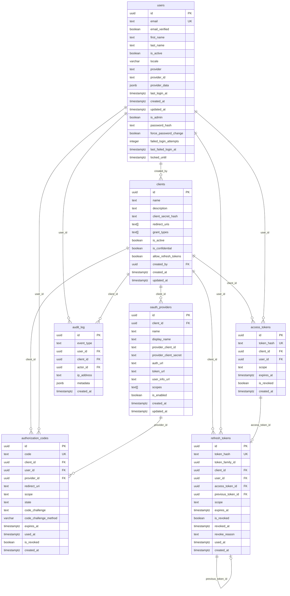

# Database Documentation

**Database:** PostgreSQL 16  
**Schema:** `public`  
**Extensions:** `pgcrypto`
**Version:** 0.3.0  
**Updated:** April 1, 2026

## Table of Contents

1. [Overview](#overview)
2. [Entity Relationship Diagram](#entity-relationship-diagram)
3. [Tables](#tables)
   - [users](#users)
   - [clients](#clients)
   - [oauth_providers](#oauth_providers)
   - [authorization_codes](#authorization_codes)
   - [access_tokens](#access_tokens)
   - [refresh_tokens](#refresh_tokens)
   - [audit_log](#audit_log)
   - [schema_migrations](#schema_migrations)
4. [Functions & Triggers](#functions--triggers)
5. [Indexes](#indexes)
6. [Migration History](#migration-history)
7. [Queries](#queries)

## Overview

This database supports an OAuth 2.0 authorization server. It manages user identities, registered client applications, per-client OAuth provider configurations, authorization codes issued during the authorization flow, access tokens granted to clients on behalf of users, refresh tokens for long-lived session management, and an append-only audit log of security-relevant events.

## Entity Relationship Diagram



## Tables

### `users`

Stores user accounts. Users can be created via external OAuth providers (e.g., Google). The `provider` and `provider_id` columns identify the upstream identity, while `provider_data` stores raw profile data returned by the provider. v0.3.0 adds local-auth and lockout columns.

| Column | Type | Nullable | Default | Description |
|---|---|---|---|---|
| `id` | `uuid` | NOT NULL | `gen_random_uuid()` | Primary key |
| `email` | `text` | NOT NULL | — | User's email address (unique) |
| `email_verified` | `boolean` | NOT NULL | `false` | Whether the email has been verified |
| `first_name` | `text` | NULL | — | User's first name |
| `last_name` | `text` | NULL | — | User's last name |
| `is_active` | `boolean` | NOT NULL | `true` | Whether the account is active |
| `locale` | `varchar(10)` | NOT NULL | `'en-US'` | Preferred locale |
| `provider` | `text` | NULL | — | Name of the OAuth provider (e.g., `google`) |
| `provider_id` | `text` | NULL | — | User ID as provided by the upstream OAuth provider |
| `provider_data` | `jsonb` | NULL | `'{}'` | Raw profile payload from the OAuth provider |
| `last_login_at` | `timestamptz` | NULL | — | Timestamp of the most recent login |
| `created_at` | `timestamptz` | NOT NULL | `now()` | Record creation timestamp |
| `updated_at` | `timestamptz` | NOT NULL | `now()` | Record last-update timestamp (auto-managed by trigger) |
| `is_admin` | `boolean` | NULL | `false` | Whether the user has administrator privileges |
| `password_hash` | `text` | NULL | — | Argon2id hash of the user's local password. `NULL` for OAuth-only accounts. |
| `force_password_change` | `boolean` | NOT NULL | `false` | When `true`, the user must set a new password before receiving an access token. |
| `failed_login_attempts` | `integer` | NOT NULL | `0` | Counter of consecutive failed login attempts within the current window. |
| `last_failed_login_at` | `timestamptz` | NULL | — | Timestamp of the most recent failed login attempt. Used to evaluate the sliding-window threshold. |
| `locked_until` | `timestamptz` | NULL | — | When non-NULL and in the future, the account is locked. Login attempts return `429` until this timestamp passes. |

**Constraints:**

| Name | Type | Columns |
|---|---|---|
| `users_pkey` | PRIMARY KEY | `id` |
| `users_email_key` | UNIQUE | `email` |
| `users_provider_provider_id_key` | UNIQUE INDEX | `provider`, `provider_id` |

**Indexes:**

| Name | Columns | Purpose |
|---|---|---|
| `users_provider_provider_id_key` | `(provider, provider_id)` | Fast lookup by upstream provider identity |
| `idx_users_is_admin` | `(is_admin)` | Fast filtering of administrator accounts |
| `idx_users_locked_until` | `(locked_until)` | Fast query for accounts with an active lockout (lock-expiry cleanup) |

### `clients`

Stores registered OAuth 2.0 client applications. Each client is created by a user and holds the hashed client secret, allowed redirect URIs, and supported grant types. v0.3.0 adds `is_confidential` and `allow_refresh_tokens` columns.

| Column | Type | Nullable | Default | Description |
|---|---|---|---|---|
| `id` | `uuid` | NOT NULL | `gen_random_uuid()` | Primary key |
| `name` | `text` | NOT NULL | — | Human-readable name for the client application |
| `description` | `text` | NULL | — | Optional description |
| `client_secret_hash` | `text` | NOT NULL | — | SHA-256 hex digest of the client secret (changed from bcrypt in v0.3.0) |
| `redirect_uris` | `text[]` | NOT NULL | — | Allowed redirect URIs for the authorization flow |
| `grant_types` | `text[]` | NOT NULL | `ARRAY['authorization_code']` | Supported OAuth grant types |
| `is_active` | `boolean` | NULL | `true` | Whether the client is active and can initiate flows |
| `is_confidential` | `boolean` | NOT NULL | `true` | Whether this is a confidential client that can keep a secret. Public clients (SPAs, mobile) set this to `false`. |
| `allow_refresh_tokens` | `boolean` | NOT NULL | `false` | Whether this client may request refresh tokens when `offline_access` scope is granted. |
| `created_by` | `uuid` | NOT NULL | — | FK → `users.id`; the admin who registered this client |
| `created_at` | `timestamptz` | NULL | `now()` | Record creation timestamp |
| `updated_at` | `timestamptz` | NULL | `now()` | Record last-update timestamp (auto-managed by trigger) |

**Constraints:**

| Name | Type | Columns |
|---|---|---|
| `clients_pkey` | PRIMARY KEY | `id` |
| `clients_created_by_fkey` | FOREIGN KEY | `created_by` → `users(id)` |

**Indexes:**

| Name | Columns | Purpose |
|---|---|---|
| `idx_clients_is_active` | `(is_active)` | Fast filtering of active clients |

### `oauth_providers`

Stores per-client OAuth provider configurations. A single client can have multiple configured providers (e.g., Google, GitHub). Each row holds the upstream provider credentials and endpoint URLs needed to drive the OAuth flow.

| Column | Type | Nullable | Default | Description |
|---|---|---|---|---|
| `id` | `uuid` | NOT NULL | `gen_random_uuid()` | Primary key |
| `client_id` | `uuid` | NOT NULL | — | FK → `clients.id`; owning client |
| `name` | `text` | NOT NULL | — | Internal provider identifier (e.g., `google`) |
| `display_name` | `text` | NOT NULL | — | Human-readable label shown in UI (e.g., `Sign in with Google`) |
| `provider_client_id` | `text` | NOT NULL | — | Client ID issued by the upstream OAuth provider |
| `provider_client_secret` | `text` | NOT NULL | — | Client secret issued by the upstream OAuth provider |
| `auth_url` | `text` | NOT NULL | — | Authorization endpoint URL of the upstream provider |
| `token_url` | `text` | NOT NULL | — | Token exchange endpoint URL of the upstream provider |
| `user_info_url` | `text` | NOT NULL | — | User info endpoint URL of the upstream provider |
| `scopes` | `text[]` | NOT NULL | — | OAuth scopes to request from the upstream provider |
| `is_enabled` | `boolean` | NULL | `false` | Whether this provider is currently enabled for use |
| `created_at` | `timestamptz` | NULL | `now()` | Record creation timestamp |
| `updated_at` | `timestamptz` | NULL | `now()` | Record last-update timestamp (auto-managed by trigger) |

**Constraints:**

| Name | Type | Columns |
|---|---|---|
| `oauth_providers_pkey` | PRIMARY KEY | `id` |
| `oauth_providers_client_id_name_key` | UNIQUE | `(client_id, name)` |
| `oauth_providers_client_id_fkey` | FOREIGN KEY | `client_id` → `clients(id)` ON DELETE CASCADE |

**Indexes:**

| Name | Columns | Purpose |
|---|---|---|
| `idx_oauth_providers_client_id` | `(client_id)` | Fast provider lookups per client |
| `idx_oauth_providers_is_enabled` | `(is_enabled)` | Fast filtering by enabled state |
| `idx_oauth_providers_client_enabled` | `(client_id, is_enabled)` | Fast lookup of enabled providers for a specific client |

### `authorization_codes`

Stores short-lived authorization codes issued during the OAuth 2.0 Authorization Code Grant flow. A code is single-use (`used_at` is set on redemption) and can be revoked. PKCE parameters (`code_challenge`, `code_challenge_method`) are stored to support public clients.

| Column | Type | Nullable | Default | Description |
|---|---|---|---|---|
| `id` | `uuid` | NOT NULL | `gen_random_uuid()` | Primary key |
| `code` | `text` | NOT NULL | — | The authorization code value (unique) |
| `client_id` | `uuid` | NOT NULL | — | FK → `clients.id`; the requesting client |
| `user_id` | `uuid` | NOT NULL | — | FK → `users.id`; the authorizing user |
| `provider_id` | `uuid` | NOT NULL | — | FK → `oauth_providers.id`; the provider used for authentication |
| `redirect_uri` | `text` | NOT NULL | — | The redirect URI included in the authorization request |
| `scope` | `text` | NULL | `''` | Requested OAuth scopes |
| `state` | `text` | NULL | — | Opaque state value from the client (CSRF protection) |
| `code_challenge` | `text` | NULL | — | PKCE code challenge (Base64URL-encoded SHA-256 of verifier) |
| `code_challenge_method` | `varchar(10)` | NULL | — | PKCE method (`S256` or `plain`) |
| `expires_at` | `timestamptz` | NOT NULL | — | Expiry timestamp; codes are invalid after this time |
| `used_at` | `timestamptz` | NULL | — | Timestamp when the code was redeemed; `NULL` if unused |
| `is_revoked` | `boolean` | NULL | `false` | Whether the code has been explicitly revoked |
| `created_at` | `timestamptz` | NULL | `now()` | Record creation timestamp |

**Constraints:**

| Name | Type | Columns |
|---|---|---|
| `authorization_codes_pkey` | PRIMARY KEY | `id` |
| `authorization_codes_code_key` | UNIQUE | `code` |
| `authorization_codes_client_id_fkey` | FOREIGN KEY | `client_id` → `clients(id)` ON DELETE CASCADE |
| `authorization_codes_user_id_fkey` | FOREIGN KEY | `user_id` → `users(id)` ON DELETE CASCADE |
| `authorization_codes_provider_id_fkey` | FOREIGN KEY | `provider_id` → `oauth_providers(id)` ON DELETE CASCADE |

**Indexes:**

| Name | Columns | Purpose |
|---|---|---|
| `idx_authorization_codes_expires_at` | `(expires_at)` | Efficient cleanup of expired codes |
| `idx_authorization_codes_user_id` | `(user_id)` | Fast lookup by user |
| `idx_authorization_codes_client_id` | `(client_id)` | Fast lookup by client |
| `idx_authorization_codes_provider_id` | `(provider_id)` | Fast lookup by provider |

### `access_tokens`

Stores issued JWT access tokens for auditing and revocation. The full token is never stored; only a hash (`token_hash`) is persisted so that a presented token can be validated and checked for revocation without storing the raw credential.

| Column | Type | Nullable | Default | Description |
|---|---|---|---|---|
| `id` | `uuid` | NOT NULL | `gen_random_uuid()` | Primary key |
| `token_hash` | `text` | NOT NULL | — | Hash of the issued JWT access token (unique) |
| `client_id` | `uuid` | NOT NULL | — | FK → `clients.id`; the client the token was issued to |
| `user_id` | `uuid` | NOT NULL | — | FK → `users.id`; the user the token represents |
| `scope` | `text` | NULL | `''` | Scopes granted by this token |
| `expires_at` | `timestamptz` | NOT NULL | — | Expiry timestamp of the token |
| `is_revoked` | `boolean` | NULL | `false` | Whether the token has been revoked |
| `created_at` | `timestamptz` | NULL | `now()` | Record creation timestamp |

**Constraints:**

| Name | Type | Columns |
|---|---|---|
| `access_tokens_pkey` | PRIMARY KEY | `id` |
| `access_tokens_token_hash_key` | UNIQUE | `token_hash` |
| `access_tokens_client_id_fkey` | FOREIGN KEY | `client_id` → `clients(id)` ON DELETE CASCADE |
| `access_tokens_user_id_fkey` | FOREIGN KEY | `user_id` → `users(id)` ON DELETE CASCADE |

**Indexes:**

| Name | Columns | Purpose |
|---|---|---|
| `idx_access_tokens_expires_at` | `(expires_at)` | Efficient cleanup of expired tokens |
| `idx_access_tokens_user_id` | `(user_id)` | Fast lookup by user |
| `idx_access_tokens_client_id` | `(client_id)` | Fast lookup by client |

### `refresh_tokens`

Stores long-lived refresh tokens issued alongside access tokens. Each token is stored as a SHA-256 hash; the plaintext is never persisted. Tokens are organized into **families** (via `token_family_id`) to enable replay detection: when a rotated token is reused, the entire family is revoked in a single statement.

| Column | Type | Nullable | Default | Description |
|---|---|---|---|---|
| `id` | `uuid` | NOT NULL | `gen_random_uuid()` | Primary key |
| `token_hash` | `text` | NOT NULL | — | SHA-256 hex digest of the plaintext token value (unique) |
| `token_family_id` | `uuid` | NOT NULL | — | Groups related tokens created by successive rotations. All tokens in a family share the same `token_family_id`. |
| `client_id` | `uuid` | NOT NULL | — | FK → `clients(id)` ON DELETE CASCADE; the issuing client |
| `user_id` | `uuid` | NOT NULL | — | FK → `users(id)` ON DELETE CASCADE; the authenticated user |
| `access_token_id` | `uuid` | NULL | — | FK → `access_tokens(id)` ON DELETE SET NULL; the access token issued alongside this refresh token |
| `previous_token_id` | `uuid` | NULL | — | Self-referential FK → `refresh_tokens(id)` ON DELETE SET NULL; the previous token in the rotation chain |
| `scope` | `text` | NULL | `''` | OAuth scopes granted to this refresh token (must include `offline_access`) |
| `expires_at` | `timestamptz` | NOT NULL | — | Absolute expiry of the token |
| `is_revoked` | `boolean` | NOT NULL | `false` | Whether this token has been revoked |
| `revoked_at` | `timestamptz` | NULL | — | Timestamp of revocation; `NULL` if not revoked |
| `revoke_reason` | `text` | NULL | — | Human-readable revocation reason: `"used"`, `"client_revoked"`, `"replay_detected"`, `"password_change"`, `"logout"`, `"admin_revoked"` |
| `used_at` | `timestamptz` | NULL | — | Timestamp when the token was rotated (consumed); `NULL` if still active |
| `created_at` | `timestamptz` | NOT NULL | `now()` | Record creation timestamp |

**Constraints:**

| Name | Type | Columns |
|---|---|---|
| `refresh_tokens_pkey` | PRIMARY KEY | `id` |
| `refresh_tokens_token_hash_key` | UNIQUE | `token_hash` |
| `refresh_tokens_client_id_fkey` | FOREIGN KEY | `client_id` → `clients(id)` ON DELETE CASCADE |
| `refresh_tokens_user_id_fkey` | FOREIGN KEY | `user_id` → `users(id)` ON DELETE CASCADE |
| `refresh_tokens_access_token_id_fkey` | FOREIGN KEY | `access_token_id` → `access_tokens(id)` ON DELETE SET NULL |
| `refresh_tokens_previous_token_id_fkey` | FOREIGN KEY | `previous_token_id` → `refresh_tokens(id)` ON DELETE SET NULL |

**Indexes:**

| Name | Columns | Purpose |
|---|---|---|
| `idx_refresh_tokens_token_hash` | `(token_hash)` | Primary token lookup path |
| `idx_refresh_tokens_family_id` | `(token_family_id)` | Find all tokens in a family (replay detection, family revocation) |
| `idx_refresh_tokens_user_id` | `(user_id)` | List or revoke all tokens for a user |
| `idx_refresh_tokens_client_id` | `(client_id)` | List or revoke all tokens for a client |
| `idx_refresh_tokens_expires_at` | `(expires_at)` | Efficient cleanup of expired tokens |
| `idx_refresh_tokens_is_revoked` | `(is_revoked)` | Fast filtering of active tokens |

**Token family model:**

When a refresh token is first issued, a new `token_family_id` (UUID) is generated. Every rotation creates a new token row with the same `token_family_id` and sets `previous_token_id` to the row just consumed. If a replay is detected (a token with `is_revoked=true` is presented), `RevokeRefreshTokenFamily` sets `is_revoked=true` on all rows sharing that `token_family_id` in one statement.

### `audit_log`

Append-only table recording security-relevant events. No rows are ever updated or deleted. The `updated_at` trigger is intentionally absent. The table never stores plaintext passwords, token values, or secrets — the `metadata` JSONB field may contain email addresses and event context.

| Column | Type | Nullable | Default | Description |
|---|---|---|---|---|
| `id` | `uuid` | NOT NULL | `gen_random_uuid()` | Primary key |
| `event_type` | `text` | NOT NULL | — | One of the 15 defined event type constants (e.g. `"account_locked"`) |
| `user_id` | `uuid` | NULL | — | FK → `users(id)`; the subject user (optional) |
| `client_id` | `uuid` | NULL | — | FK → `clients(id)`; the subject client (optional) |
| `actor_id` | `uuid` | NULL | — | FK → `users(id)`; the admin or user who performed the action (optional) |
| `ip_address` | `text` | NULL | — | Source IP address of the request (optional) |
| `metadata` | `jsonb` | NULL | `'{}'` | Structured context about the event. Never contains secrets. |
| `created_at` | `timestamptz` | NOT NULL | `now()` | Immutable creation timestamp |

**Constraints:**

| Name | Type | Columns |
|---|---|---|
| `audit_log_pkey` | PRIMARY KEY | `id` |
| `audit_log_user_id_fkey` | FOREIGN KEY | `user_id` → `users(id)` ON DELETE SET NULL |
| `audit_log_client_id_fkey` | FOREIGN KEY | `client_id` → `clients(id)` ON DELETE SET NULL |
| `audit_log_actor_id_fkey` | FOREIGN KEY | `actor_id` → `users(id)` ON DELETE SET NULL |

**Indexes:**

| Name | Columns | Purpose |
|---|---|---|
| `idx_audit_log_event_type` | `(event_type)` | Filter by event type |
| `idx_audit_log_user_id` | `(user_id)` | Filter by subject user |
| `idx_audit_log_client_id` | `(client_id)` | Filter by subject client |
| `idx_audit_log_created_at` | `(created_at)` | Time-range queries and sorting |

### `schema_migrations`

Internal table managed by [golang-migrate](https://github.com/golang-migrate/migrate). Tracks which migrations have been applied.

| Column | Type | Nullable | Description |
|---|---|---|---|
| `version` | `bigint` | NOT NULL | Timestamp-based migration version |
| `dirty` | `boolean` | NOT NULL | `true` if the last migration failed mid-run |

**Constraints:**

| Name | Type | Columns |
|---|---|---|
| `schema_migrations_pkey` | PRIMARY KEY | `version` |

## Functions & Triggers

### `internal_set_updated_at()`

A `BEFORE UPDATE` trigger function that automatically sets `updated_at = now()` on any row modification.

```sql
CREATE FUNCTION public.internal_set_updated_at() RETURNS trigger
    LANGUAGE plpgsql AS $$
BEGIN
    NEW.updated_at = now();
    RETURN NEW;
END;
$$;
```

This trigger is attached to the following tables:

| Table | Trigger Name |
|---|---|
| `users` | `set_updated_at` |
| `clients` | `set_updated_at` |
| `oauth_providers` | `set_updated_at` |

## Indexes

Summary of all non-primary-key indexes:

| Index | Table | Columns | Type |
|---|---|---|---|
| `users_provider_provider_id_key` | `users` | `(provider, provider_id)` | UNIQUE |
| `idx_users_is_admin` | `users` | `(is_admin)` | BTREE |
| `idx_users_locked_until` | `users` | `(locked_until)` | BTREE |
| `idx_clients_is_active` | `clients` | `(is_active)` | BTREE |
| `idx_oauth_providers_client_id` | `oauth_providers` | `(client_id)` | BTREE |
| `idx_oauth_providers_is_enabled` | `oauth_providers` | `(is_enabled)` | BTREE |
| `idx_oauth_providers_client_enabled` | `oauth_providers` | `(client_id, is_enabled)` | BTREE |
| `idx_authorization_codes_expires_at` | `authorization_codes` | `(expires_at)` | BTREE |
| `idx_authorization_codes_user_id` | `authorization_codes` | `(user_id)` | BTREE |
| `idx_authorization_codes_client_id` | `authorization_codes` | `(client_id)` | BTREE |
| `idx_authorization_codes_provider_id` | `authorization_codes` | `(provider_id)` | BTREE |
| `idx_access_tokens_expires_at` | `access_tokens` | `(expires_at)` | BTREE |
| `idx_access_tokens_user_id` | `access_tokens` | `(user_id)` | BTREE |
| `idx_access_tokens_client_id` | `access_tokens` | `(client_id)` | BTREE |
| `idx_refresh_tokens_token_hash` | `refresh_tokens` | `(token_hash)` | BTREE |
| `idx_refresh_tokens_family_id` | `refresh_tokens` | `(token_family_id)` | BTREE |
| `idx_refresh_tokens_user_id` | `refresh_tokens` | `(user_id)` | BTREE |
| `idx_refresh_tokens_client_id` | `refresh_tokens` | `(client_id)` | BTREE |
| `idx_refresh_tokens_expires_at` | `refresh_tokens` | `(expires_at)` | BTREE |
| `idx_refresh_tokens_is_revoked` | `refresh_tokens` | `(is_revoked)` | BTREE |
| `idx_audit_log_event_type` | `audit_log` | `(event_type)` | BTREE |
| `idx_audit_log_user_id` | `audit_log` | `(user_id)` | BTREE |
| `idx_audit_log_client_id` | `audit_log` | `(client_id)` | BTREE |
| `idx_audit_log_created_at` | `audit_log` | `(created_at)` | BTREE |

## Migration History

Migrations are managed with [golang-migrate](https://github.com/golang-migrate/migrate) and live in `db/migrations/`. Each migration has an `.up.sql` and a `.down.sql` file.

| Version | File | Description |
|---|---|---|
| `20260109145607` | `create_users_table` | Creates the `users` table, `pgcrypto` extension, unique index on `(provider, provider_id)`, and the `internal_set_updated_at` trigger function |
| `20260213095938` | `add_is_admin_to_users` | Adds the `is_admin` boolean column to `users` and creates `idx_users_is_admin` |
| `20260213100111` | `create_clients_table` | Creates the `clients` table with FK to `users`, `is_active` index, and `set_updated_at` trigger |
| `20260216155147` | `create_oauth_providers_table` | Creates the `oauth_providers` table with FK to `clients` (CASCADE), three indexes, and `set_updated_at` trigger |
| `20260216155730` | `create_authorization_codes_table` | Creates the `authorization_codes` table with FKs to `clients`, `users`, and `oauth_providers` (all CASCADE), plus four indexes |
| `20260301120000` | `create_access_tokens_table` | Creates the `access_tokens` table with FKs to `clients` and `users` (both CASCADE), plus three indexes |
| `20260326090601` | `add_lockout_force_password_to_users` | Adds `password_hash`, `force_password_change`, `failed_login_attempts`, `last_failed_login_at`, `locked_until` to `users`; creates `idx_users_locked_until` |
| `20260326092318` | `add_confidential_refresh_tokens_to_clients` | Adds `is_confidential` (default `true`) and `allow_refresh_tokens` (default `false`) to `clients` |
| `20260326092900` | `create_refresh_tokens_table` | Creates the `refresh_tokens` table with all 14 columns, 4 foreign keys (including self-referential), and 6 indexes |
| `20260326093100` | `create_audit_log_table` | Creates the append-only `audit_log` table with 8 columns and 4 indexes; no `updated_at` trigger |

## Queries

SQLC-generated queries are defined in `db/queries/` and correspond to methods on the repository layer.

### Users (`db/queries/users.sql`)

| Query Name | Operation | Description |
|---|---|---|
| `CreateUser` | `INSERT` | Inserts a new user record and returns it |
| `GetUserByEmail` | `SELECT` | Looks up a single user by `email` |
| `GetUserByProviderID` | `SELECT` | Looks up a single user by `(provider, provider_id)` |
| `GetUserByID` | `SELECT` | Looks up a single user by `id` |
| `UpdateLastLogin` | `UPDATE` | Updates `provider_data` and `last_login_at` for a user |
| `UpdateUser` | `UPDATE` | Updates `email`, `email_verified`, `first_name`, `last_name`, and `locale` for a user |
| `ListUsers` | `SELECT` | Returns a paginated list of users, optionally filtered by `is_active` or `is_admin` |
| `CountUsers` | `SELECT` | Returns the count of users matching optional `is_active`/`is_admin` filters |
| `UpdateUserActiveStatus` | `UPDATE` | Sets `is_active` for a user by `id` |
| `GetUsersByAdmin` | `SELECT` | Returns all users with `is_admin = $1` ordered by `created_at DESC` |
| `GetUserByEmailForAuth` | `SELECT` | Looks up a user by `email` for credential authentication (includes lockout fields) |
| `UpdatePasswordHash` | `UPDATE` | Sets `password_hash` for a user by `id` |
| `SetForcePasswordChange` | `UPDATE` | Sets `force_password_change` flag for a user by `id` |
| `IncrementFailedLoginAttempts` | `UPDATE` | Increments `failed_login_attempts` and sets `last_failed_login_at = now()` |
| `LockUserAccount` | `UPDATE` | Sets `locked_until` timestamp for a user by `id` |
| `ResetLoginAttempts` | `UPDATE` | Clears `failed_login_attempts`, `last_failed_login_at`, and `locked_until` after successful login |
| `UnlockUserAccount` | `UPDATE` | Clears `locked_until` for a user by `id` (admin override) |
| `CountAdminUsers` | `SELECT` | Returns the count of users with `is_admin = true` |

### Clients (`db/queries/clients.sql`)

| Query Name | Operation | Description |
|---|---|---|
| `GetClient` | `SELECT` | Looks up any client by `id` (including inactive) |
| `GetClientByID` | `SELECT` | Looks up an active client by `id` |
| `ListClients` | `SELECT` | Returns a paginated list of clients, optionally filtered by `is_active` |
| `CountClients` | `SELECT` | Returns the count of clients matching optional `is_active` filter |
| `CreateClient` | `INSERT` | Inserts a new client record including `is_confidential` and `allow_refresh_tokens` |
| `UpdateClient` | `UPDATE` | Updates client fields including `is_confidential` and `allow_refresh_tokens` |
| `DeleteClient` | `UPDATE` | Soft-deletes a client by setting `is_active = false` |
| `RegenerateClientSecret` | `UPDATE` | Replaces `client_secret_hash` (SHA-256 hex) for a client by `id` |

### OAuth Providers (`db/queries/oauth_providers.sql`)

See existing repository documentation — no new queries added in v0.3.0.

### Authorization Codes (`db/queries/authorization_codes.sql`)

See existing repository documentation — no new queries added in v0.3.0.

### Access Tokens (`db/queries/access_tokens.sql`)

See existing repository documentation — no new queries added in v0.3.0.

### Refresh Tokens (`db/queries/refresh_tokens.sql`)

| Query Name | Operation | Description |
|---|---|---|
| `CreateRefreshToken` | `INSERT` | Inserts a new refresh token record and returns it; requires `token_hash`, `token_family_id`, `client_id`, `user_id`, `scope`, and `expires_at` |
| `GetRefreshTokenByHash` | `SELECT` | Looks up a single refresh token by its SHA-256 `token_hash` |
| `GetRefreshTokenByID` | `SELECT` | Looks up a single refresh token by `id` |
| `ListRefreshTokensByUser` | `SELECT` | Returns a paginated list of refresh tokens for a user, ordered by `created_at DESC` |
| `CountRefreshTokensByUser` | `SELECT` | Returns the count of refresh tokens for a user |
| `RevokeRefreshToken` | `UPDATE` | Sets `is_revoked = true`, `revoked_at = now()`, and `revoke_reason` for a single token |
| `RevokeRefreshTokenFamily` | `UPDATE` | Revokes all tokens sharing a `token_family_id` (replay detection cascade) |
| `MarkRefreshTokenUsed` | `UPDATE` | Marks a token as used (sets `used_at`, `is_revoked = true`, `revoke_reason = 'used'`) prior to issuing a rotated token |
| `RevokeRefreshTokensByUser` | `UPDATE` | Revokes all non-revoked tokens for a user (used on logout or password change) |
| `DeleteExpiredRefreshTokens` | `DELETE` | Deletes all tokens where `expires_at < now()` (maintenance/cleanup job) |

### Audit Log (`db/queries/audit_log.sql`)

| Query Name | Operation | Description |
|---|---|---|
| `CreateAuditLogEntry` | `INSERT` | Inserts a new audit event and returns its `id`; `user_id`, `client_id`, `actor_id`, and `ip_address` are nullable |
| `ListAuditLogEntries` | `SELECT` | Returns a paginated, filtered list of audit events; supports optional filters on `event_type`, `user_id`, and `client_id`, ordered by `created_at DESC` |
| `CountAuditLogEntries` | `SELECT` | Returns the count of audit events matching the same optional filters as `ListAuditLogEntries` |
