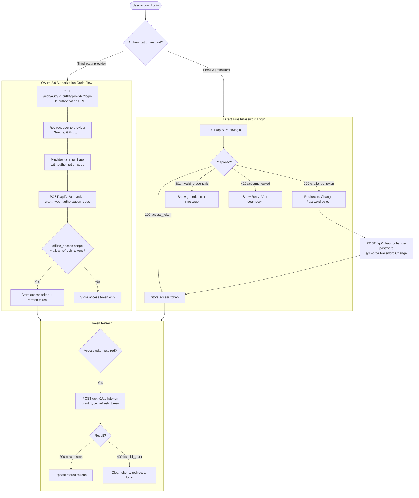

# Frontend Integration Guide

**Version:** 0.3.0  
**Created:** March 30, 2026  
**Audience:** Frontend / SPA / Mobile Developers

---

## Table of Contents

1. [Overview & Prerequisites](#1-overview--prerequisites)
2. [Authentication Flows](#2-authentication-flows)
3. [Email & Password Login](#3-email--password-login)
4. [Force Password Change](#4-force-password-change)
5. [Token Management](#5-token-management)
6. [Refresh Tokens](#6-refresh-tokens)
7. [Token Revocation & Logout](#7-token-revocation--logout)
8. [Error Handling Reference](#8-error-handling-reference)
9. [Security Best Practices](#9-security-best-practices)
10. [Complete Code Examples](#10-complete-code-examples)

---

## 1. Overview & Prerequisites

The Goauth Server is an OAuth 2.0 Authorization Server that also exposes a first-party email/password login endpoint. From a frontend perspective, it supports two primary authentication paths:

| Path | When to use |
|------|-------------|
| **OAuth 2.0 Authorization Code Flow** | Log in via a third-party identity provider (Google, GitHub, etc.) |
| **Direct Email/Password Login** | Log in with a server-managed account (bootstrapped admin, or future local-auth users) |

### Prerequisites

Before integrating, ensure you have:

- A **registered OAuth client** with a known `client_id`.
- Your application's **redirect URIs** registered for the client.
- The **base URL** of the auth server (e.g. `https://auth.example.com`).
- The **scopes** your application needs. Include `offline_access` to receive a refresh token.

### Token model

The server issues **short-lived JWT access tokens** (signed ES256). Access tokens are self-contained — the server's public key can be used to verify them offline. Optionally, **refresh tokens** are issued when the client has `allow_refresh_tokens = true` and the granted scope includes `offline_access`.

For full OAuth 2.0 Authorization Code Flow integration details, see [ClientIntegrationGuide.md](ClientIntegrationGuide.md).

---

## 2. Authentication Flows

The following diagram depicts the two primary authentication paths and how they relate to token management:



---

## 3. Email & Password Login

**Endpoint:** `POST /api/v1/auth/login`

### Request

```typescript
const response = await fetch('/api/v1/auth/login', {
  method: 'POST',
  headers: { 'Content-Type': 'application/json' },
  body: JSON.stringify({ email, password }),
});
```

### Success Response — Normal Login (HTTP 200)

```json
{
  "access_token": "eyJhbGciOiJFUzI1NiIsInR5cCI6IkpXVCJ9...",
  "token_type": "Bearer",
  "expires_in": 900
}
```

Extract `access_token` and store it securely (see §5).

### Success Response — Force Password Change (HTTP 200)

If the logged-in account has `force_password_change = true`, the server returns:

```json
{
  "force_password_change": true,
  "challenge_token": "eyJhbGciOiJIUzI1NiIsInR5cCI6IkpXVCJ9..."
}
```

**Required UI action:** Store the `challenge_token` temporarily (in-memory only, never persisted) and redirect the user to a dedicated "Set New Password" screen. See §4.

### Error: Invalid Credentials (HTTP 401)

```json
{ "error": "invalid_credentials", "error_description": "invalid email or password" }
```

**UI action:** Display a generic "Invalid email or password" message. Never indicate whether the email exists.

### Error: Account Locked (HTTP 429)

```json
{
  "error": "account_locked",
  "error_description": "account is locked",
  "locked_until": "2026-03-30T12:05:00Z"
}
```

The response also includes a `Retry-After` HTTP header with the number of seconds remaining.

**UI action:** Disable the login form, display a countdown timer using the `Retry-After` value, and re-enable the form when the countdown reaches zero.

```typescript
const retryAfter = parseInt(response.headers.get('Retry-After') ?? '60', 10);
startLockoutCountdown(retryAfter); // disable form, show countdown
```

### Error: Validation (HTTP 400)

```json
{ "error": "invalid_request", "error_description": "email is required" }
```

**UI action:** Show field-level validation feedback.

---

## 4. Force Password Change

**Endpoint:** `POST /api/v1/auth/change-password`

This endpoint is only accessible with a valid `challenge_token` obtained from a `force_password_change` login response (§3).

### UI Flow

1. Receive the `challenge_token` from the login response.
2. Display a dedicated "Set New Password" screen.
3. Show the following password requirements as a checklist:
   - At least 12 characters
   - At least one uppercase letter
   - At least one lowercase letter
   - At least one digit (0–9)
   - At least one special character (e.g. `!@#$%^&*`)
   - Must not be a commonly-used password
   - Must not contain the user's email address
4. Submit the form to `POST /api/v1/auth/change-password`.
5. On success, store the returned `access_token` and proceed normally.

### Request

```typescript
const response = await fetch('/api/v1/auth/change-password', {
  method: 'POST',
  headers: {
    'Content-Type': 'application/json',
    'Authorization': `Bearer ${challengeToken}`,
  },
  body: JSON.stringify({ new_password: newPassword }),
});
```

### Success Response (HTTP 200)

```json
{
  "access_token": "eyJhbGciOiJFUzI1NiIsInR5cCI6IkpXVCJ9...",
  "token_type": "Bearer",
  "expires_in": 900
}
```

All previous refresh tokens for the user are automatically revoked when the password is changed.

### Error Responses

| Status | `error` | Cause | UI action |
|--------|---------|-------|-----------|
| `400` | `invalid_request` | Challenge token expired or malformed | Redirect back to login |
| `400` | `weak_password` | Password fails complexity policy | Show per-rule feedback |
| `409` | `already_completed` | `force_password_change` was already cleared (challenge token reuse) | Redirect to login |

---

## 5. Token Management

### Storage

| Storage location | Recommendation |
|-----------------|----------------|
| **In-memory variable** | Recommended for SPAs. Tokens are cleared on page reload (mitigates XSS). |
| **`HttpOnly` cookie** | Recommended for server-side rendered apps. The browser sends the cookie automatically and JavaScript cannot access it. |
| ~~`localStorage` / `sessionStorage`~~ | **Not recommended.** Vulnerable to XSS theft. |

### Attaching the Token

Include the access token in the `Authorization` header of every API request to protected resources:

```typescript
const apiResponse = await fetch('/api/v1/protected-resource', {
  headers: { 'Authorization': `Bearer ${accessToken}` },
});
```

### Detecting and Handling Expiry

When an API call returns `401 invalid_token`, the access token is expired or invalid. The recommended flow:

1. Intercept the `401` response.
2. Attempt a silent refresh using the stored refresh token (§6).
3. If the refresh succeeds, retry the original request with the new access token.
4. If the refresh fails (e.g. `400 invalid_grant`), clear all tokens and redirect to login.

### Proactive Refresh

Optionally, decode the JWT locally to read the `exp` claim and schedule a background refresh shortly before expiry (e.g. 60 seconds early):

```typescript
function getTokenExpiry(token: string): number {
  const payload = JSON.parse(atob(token.split('.')[1]));
  return payload.exp * 1000; // milliseconds
}

function scheduleProactiveRefresh(token: string, onRefresh: () => Promise<void>) {
  const expiresAt = getTokenExpiry(token);
  const refreshAt = expiresAt - 60_000; // 60 seconds before expiry
  const delay = refreshAt - Date.now();
  if (delay > 0) {
    setTimeout(onRefresh, delay);
  }
}
```

---

## 6. Refresh Tokens

### Receiving a Refresh Token

A refresh token is only returned when **both** conditions are met:

1. The client has `allow_refresh_tokens = true` (set by an administrator).
2. The granted scope includes `offline_access`.

Include `offline_access` in your authorization request's `scope` parameter to request a refresh token. Example token response:

```json
{
  "access_token": "eyJhbGciOiJFUzI1NiIsInR5cCI6IkpXVCJ9...",
  "refresh_token": "dGhpcy1pcy1hLXNhbXBsZS1yZWZyZXNoLXRva2Vu",
  "token_type": "Bearer",
  "expires_in": 900
}
```

### Refresh Token Storage

Store refresh tokens in an **`HttpOnly` cookie** only. Never store them in `localStorage`, `sessionStorage`, or in-memory JavaScript variables. This prevents JavaScript-based theft (XSS).

### Performing a Token Refresh

```
POST /api/v1/auth/token
Content-Type: application/x-www-form-urlencoded

grant_type=refresh_token
&refresh_token=<token>
&client_id=<uuid>
&client_secret=<secret>
```

Success response:

```json
{
  "access_token": "eyJhbGciOiJFUzI1NiIsInR5cCI6IkpXVCJ9...",
  "refresh_token": "bmV3LXJvdGF0ZWQtcmVmcmVzaC10b2tlbg==",
  "token_type": "Bearer",
  "expires_in": 900
}
```

### Rotate-on-Use Behaviour

The server uses **rotate-on-use**: every successful refresh issues a **new** refresh token and invalidates the old one. Always store the refresh token from the latest response and discard the previous one.

### Replay Detection

If a previously-used (revoked) refresh token is presented, the server detects a replay attack: it immediately revokes the **entire token family** and returns `400 invalid_grant`. This means any concurrent sessions using tokens from the same family will also be invalidated. 

**UI action:** Clear all tokens and redirect the user to login with a message such as "Your session has expired. Please log in again."

### Silent Refresh Pattern

To avoid concurrent requests all triggering a refresh simultaneously, use a singleton promise:

```typescript
let refreshPromise: Promise<TokenPair> | null = null;

async function silentRefresh(): Promise<TokenPair> {
  if (!refreshPromise) {
    refreshPromise = performRefresh().finally(() => {
      refreshPromise = null;
    });
  }
  return refreshPromise;
}
```

---

## 7. Token Revocation & Logout

**Endpoint:** `POST /api/v1/auth/revoke`

Always revoke the refresh token before clearing local state to prevent the token from being used after logout.

### Request

```
POST /api/v1/auth/revoke
Content-Type: application/x-www-form-urlencoded
Authorization: Basic <base64(client_id:client_secret)>

token=<refresh_token>
&token_type_hint=refresh_token
```

The endpoint always returns **HTTP 200**, even if the token is not recognized (per RFC 7009). Treat any network error as a soft failure — still clear local tokens.

### Logout Flow

```typescript
async function logout(refreshToken: string): Promise<void> {
  try {
    await revokeToken(refreshToken);
  } catch {
    // Soft failure — proceed with local cleanup regardless
  }
  clearAccessToken();           // clear in-memory access token
  clearRefreshTokenCookie();    // clear HttpOnly cookie (server-side)
  window.location.href = '/login';
}
```

---

## 8. Error Handling Reference

The following table covers all HTTP error responses from auth endpoints that require frontend action.

| Status | `error` field | Trigger | Recommended UI action |
|--------|--------------|---------|----------------------|
| `400` | `invalid_request` | Malformed request body or missing field | Show field validation errors |
| `400` | `invalid_grant` | Expired or replayed refresh token | Clear all tokens, redirect to login |
| `400` | `weak_password` | Password fails complexity policy | Show per-rule feedback |
| `401` | `invalid_credentials` | Wrong email or password | Generic "Invalid email or password" |
| `401` | `invalid_token` | Expired or invalid access token | Attempt silent refresh (§6) |
| `401` | `invalid_client` | Client credentials rejected | Log error; do not expose details to the user |
| `409` | `already_completed` | `force_password_change` already cleared | Redirect to login |
| `429` | `account_locked` | Too many failed login attempts | Show lockout countdown from `Retry-After` header |

---

## 9. Security Best Practices

- **Never store tokens in `localStorage` or `sessionStorage`.** These are accessible to any JavaScript on the page and are vulnerable to XSS. Use in-memory storage for access tokens and `HttpOnly` cookies for refresh tokens.
- **Use HTTPS only.** Never send tokens over plain HTTP.
- **Use `state` and PKCE** (`code_challenge` / `code_verifier`) in the Authorization Code Flow to prevent CSRF and authorization code injection.
- **Implement the silent-refresh singleton** (§6) to prevent multiple concurrent refresh requests. A race condition can trigger replay detection and invalidate the user's entire session.
- **Clear all tokens** on explicit logout, after detecting a `400 invalid_grant`, and after any replay detection error.
- **Respect `Retry-After`.** Do not retry login before the lockout expires — additional failed attempts extend the lockout window server-side.
- **Do not display different messages** for "email not found" vs. "wrong password". Always show a generic "Invalid email or password" to prevent account enumeration.
- **Clear in-memory tokens on tab/window close** by not persisting them. If access tokens must survive a page reload, use `HttpOnly` cookies managed by your backend (token proxy pattern).

---

## 10. Complete Code Examples

The following TypeScript examples use the standard `fetch` API and assume access tokens are stored in-memory and refresh tokens stored in server-managed `HttpOnly` cookies.

### `loginUser`

```typescript
interface LoginSuccess {
  accessToken: string;
}

interface ForcePasswordChangeRequired {
  forcePasswordChange: true;
  challengeToken: string;
}

interface LoginLocked {
  locked: true;
  retryAfterSeconds: number;
}

type LoginResult = LoginSuccess | ForcePasswordChangeRequired | LoginLocked;

async function loginUser(email: string, password: string): Promise<LoginResult> {
  const response = await fetch('/api/v1/auth/login', {
    method: 'POST',
    headers: { 'Content-Type': 'application/json' },
    body: JSON.stringify({ email, password }),
  });

  if (response.status === 429) {
    const retryAfter = parseInt(response.headers.get('Retry-After') ?? '60', 10);
    return { locked: true, retryAfterSeconds: retryAfter };
  }

  if (!response.ok) {
    const body = await response.json();
    throw new Error(body.error_description ?? 'Login failed');
  }

  const body = await response.json();

  if (body.force_password_change && body.challenge_token) {
    return { forcePasswordChange: true, challengeToken: body.challenge_token };
  }

  return { accessToken: body.access_token };
}
```

### `changePassword`

```typescript
async function changePassword(
  challengeToken: string,
  newPassword: string,
): Promise<string> {
  const response = await fetch('/api/v1/auth/change-password', {
    method: 'POST',
    headers: {
      'Content-Type': 'application/json',
      'Authorization': `Bearer ${challengeToken}`,
    },
    body: JSON.stringify({ new_password: newPassword }),
  });

  if (!response.ok) {
    const body = await response.json();
    if (body.error === 'weak_password') {
      throw new Error('Password does not meet complexity requirements');
    }
    if (body.error === 'already_completed') {
      throw new Error('Password change already completed. Please log in.');
    }
    // challenge token expired or malformed — redirect to login
    throw new Error('invalid_challenge_token');
  }

  const body = await response.json();
  return body.access_token;
}
```

### `refreshAccessToken`

```typescript
interface TokenPair {
  accessToken: string;
  refreshToken: string;
}

// Singleton guard to prevent concurrent refresh races
let refreshPromise: Promise<TokenPair> | null = null;

async function refreshAccessToken(
  clientId: string,
  clientSecret: string,
): Promise<TokenPair> {
  if (!refreshPromise) {
    refreshPromise = _doRefresh(clientId, clientSecret).finally(() => {
      refreshPromise = null;
    });
  }
  return refreshPromise;
}

async function _doRefresh(clientId: string, clientSecret: string): Promise<TokenPair> {
  // refreshToken is read from an HttpOnly cookie by the server, or
  // passed explicitly if using a token proxy / BFF pattern.
  const params = new URLSearchParams({
    grant_type: 'refresh_token',
    client_id: clientId,
    client_secret: clientSecret,
  });

  const response = await fetch('/api/v1/auth/token', {
    method: 'POST',
    headers: { 'Content-Type': 'application/x-www-form-urlencoded' },
    body: params.toString(),
    credentials: 'include', // sends the HttpOnly refresh token cookie
  });

  if (!response.ok) {
    const body = await response.json();
    throw new Error(body.error ?? 'token_refresh_failed');
  }

  const body = await response.json();
  return {
    accessToken: body.access_token,
    refreshToken: body.refresh_token,
  };
}
```

### `revokeToken`

```typescript
async function revokeToken(
  token: string,
  clientId: string,
  clientSecret: string,
): Promise<void> {
  const credentials = btoa(`${clientId}:${clientSecret}`);
  const params = new URLSearchParams({
    token,
    token_type_hint: 'refresh_token',
  });

  await fetch('/api/v1/auth/revoke', {
    method: 'POST',
    headers: {
      'Content-Type': 'application/x-www-form-urlencoded',
      'Authorization': `Basic ${credentials}`,
    },
    body: params.toString(),
  });
  // Always succeeds per RFC 7009; ignore errors and proceed with local cleanup.
}
```

### `AuthClient` class

A complete `AuthClient` wires all four helpers together with an auto-refresh interceptor that silently retries failed API calls on `401`.

```typescript
class AuthClient {
  private accessToken: string | null = null;

  constructor(
    private readonly clientId: string,
    private readonly clientSecret: string,
    private readonly baseUrl: string = '',
  ) {}

  /** Log in with email and password. Handles lockout and force-password-change. */
  async login(email: string, password: string): Promise<void> {
    const result = await loginUser(email, password);

    if ('locked' in result) {
      throw new LockoutError(result.retryAfterSeconds);
    }

    if ('forcePasswordChange' in result) {
      throw new ForcePasswordChangeError(result.challengeToken);
    }

    this.accessToken = result.accessToken;
  }

  /** Complete a forced password change and store the resulting access token. */
  async completePasswordChange(challengeToken: string, newPassword: string): Promise<void> {
    this.accessToken = await changePassword(challengeToken, newPassword);
  }

  /** Make an authenticated request to a protected resource. Auto-refreshes on 401. */
  async request(path: string, init: RequestInit = {}): Promise<Response> {
    const response = await this._fetch(path, init);

    if (response.status === 401) {
      // Attempt silent refresh, then retry once.
      try {
        const tokens = await refreshAccessToken(this.clientId, this.clientSecret);
        this.accessToken = tokens.accessToken;
        return this._fetch(path, init);
      } catch {
        this.accessToken = null;
        throw new SessionExpiredError();
      }
    }

    return response;
  }

  /** Revoke the refresh token, clear the access token, and redirect to login. */
  async logout(refreshToken: string): Promise<void> {
    try {
      await revokeToken(refreshToken, this.clientId, this.clientSecret);
    } catch {
      // Soft failure — always clear local state
    }
    this.accessToken = null;
    window.location.href = '/login';
  }

  private _fetch(path: string, init: RequestInit): Promise<Response> {
    return fetch(`${this.baseUrl}${path}`, {
      ...init,
      headers: {
        ...init.headers,
        ...(this.accessToken
          ? { Authorization: `Bearer ${this.accessToken}` }
          : {}),
      },
      credentials: 'include',
    });
  }
}

// Custom error types
class LockoutError extends Error {
  constructor(public readonly retryAfterSeconds: number) {
    super('account_locked');
  }
}

class ForcePasswordChangeError extends Error {
  constructor(public readonly challengeToken: string) {
    super('force_password_change');
  }
}

class SessionExpiredError extends Error {
  constructor() {
    super('session_expired');
  }
}
```

---

*For full OAuth 2.0 Authorization Code Flow integration details, including client registration, scope negotiation, and PKCE, see [ClientIntegrationGuide.md](ClientIntegrationGuide.md).*
